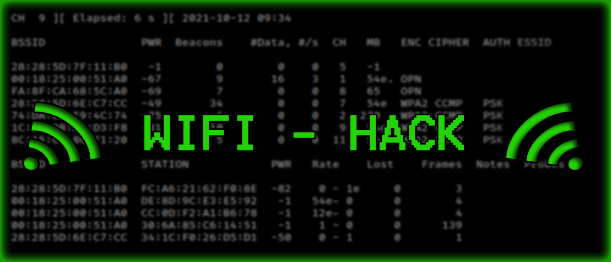

<p align="center">
  
</p>

<h1 align="center">WiFiSecurityLab</h1>

<p align="center">
Educational Wireless Security Toolkit
</p>

<p align="center">
Developed by <strong>GhostX</strong>
</p>

<p align="center">


</p>

---

## About

WiFiSecurityLab is a Python-based toolkit for studying wireless security concepts in authorized environments. The project is intended for learning, research, and defensive security assessments.

---

## Features

- Automatic Wi-Fi interface detection
- Wireless network scanning
- Password policy evaluation
- Password variation generation
- Progress monitoring
- Session logging
- Statistics & execution reports

---

## Requirements

- Python 3.10+
- Windows
- Wireless Adapter

---

## Installation

```bash
git clone https://github.com/ceonet/WiFiSecurityLab.git
cd WiFiSecurityLab
pip install -r requirements.txt
```

---

## Author

**GhostX**

GitHub: https://github.com/ceonet

---

## License

This project is licensed under the MIT License.

---

## Disclaimer

This project is intended solely for educational purposes and authorized wireless security assessments. Only use this software on systems and networks you own or have explicit permission to evaluate.

---

<p align="center">
⭐ If you find this project useful, consider giving it a Star.
</p>
